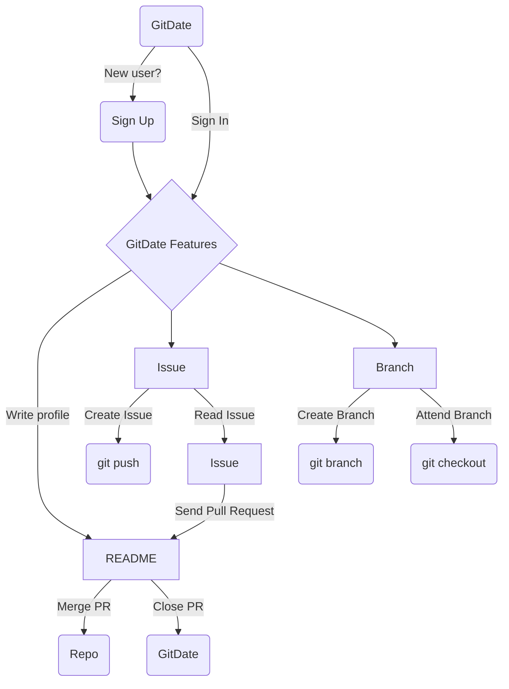

<a href="#about-gitdate-" >About</a> | <a href="#demo-" >Demo</a> | <a href="#contact-%EF%B8%8F" >Contact</a>

   
  
  

# GitDate

<a href="https://gitdate-ec8a6.web.app/" target="_blank">GitDate</a> is a dating, event website for digital nomads with Gitflow and GitHub interface.

 

## About GitDate 🖐

 
👥 Find activities 👥

 👀 Meet people 👀

 
 💜 Find love 💜
 

  💻 With computer and smartphone 💻 

  ✈ Without borders ✈

  ⚡ With GitHub styles ⚡

* Developed with **TypeScript**, **React**, **React Router v6**, **Redux** (User registration and login state management), and **Styled Components** for RWD layout, and **CSS animation**.
* Aligned **React Joyride** to provide guided tours for users to have a deeper understanding of the website.
* Adopted **Tiptap Editor** to create more customized and diverse user-generated content.
* Connected **Google Maps Platform (Places, Geocoding, Maps JavaScript API)** to provide a better user experience by auto-completing addresses, and rendering geocode locations into UI.
* Integrated **GitGraph.js** to visualize dynamic interaction among users by representing Gitflow feature. 
* Utilized **React Calendar** to manipulate and manage dates for activities created by users.
* Completed native user management system with **Firebase Authentication**.
* Designed data structure of chatroom and managed data with **Firebase Firestore Database**.

### Website structure

### Flow chart

### Other cool features

* README.md - You can create your own README and share with others 🙌
* GitGraph - To show how active you are in GitDate! 💃

* git cheatsheet - Don't be afraid if you are not an engineer 😉

### Development tools

* React
* TypeScript
* Redux
* Google Maps Platform
  - Places API
  - Geocoding API
  - Maps JavaScript API
* <a href="https://github.com/gilbarbara/react-joyride" target="_blank">React Joyride</a>
* <a href="https://github.com/wojtekmaj/react-calendar" target="_blank">React Calendar</a>
* <a href="https://github.com/nicoespeon/gitgraph.js/" target="_blank">GitGraph.js</a>
* <a href="https://github.com/ueberdosis/tiptap" target="_blank">Tiptap Editor</a>

## Demo 💖

1. Auto-start tours in GitDate, and `Docs` for tours in every page

2. After Sign in / Sign Up, you could write your own `README` and see/share your public README!

3. You can find different types of `Branches` (activities) by filters or dates, then checkout to this branch. Of course, you can initial new branch as well! 

4. You can find all the `Issues` (posts) created by users, and click to see the author's README. If you are interested in the author, don't hesitate to send a pull request!

5. When another user recieved a pull request, the notification will appear, user could decide to merge or close the PR. If PR merged, the `Repo` (chatrooms) will open, then both users can start chatting!

6. Mobile version is available as well!

 &nbsp; &nbsp; &nbsp; &nbsp; &nbsp; &nbsp; &nbsp; &nbsp;  &nbsp; &nbsp; &nbsp; &nbsp; &nbsp; &nbsp; &nbsp; &nbsp; 

> Push on GitDate, Merge your soulmate!
>
> Happy coding and Happy dating! ✨✨✨

## Future Features 🔜

* Recommendation: You might also like...
* Search nearby branches!
* Terminal to control the website / VIM commands
* ...more to come

## Contact 🙋‍♀️

 
